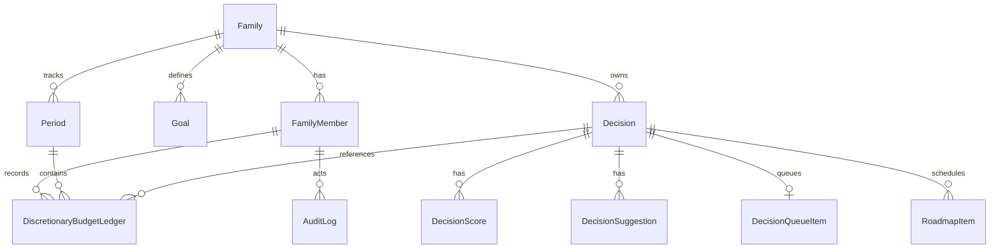

# Data Model and Indexing Plan

## ERD (Mermaid)

## Core Fields
- `Family`: id, name, created_at
- `FamilyMember`: id, family_id, email, display_name, role
- `Goal`: id, family_id, name, description, action_types, weight, active
- `Decision`: id, family_id, title, description, created_by_member_id, owner_member_id, cost, urgency, target_date, tags, status, notes, attachments, links, version, created_at
- `DecisionScore`: decision_id, goal_id, score_1_to_5, rationale, computed_by, version
- `DecisionSuggestion`: decision_id, suggested_change, expected_score_impact, rationale
- `DecisionQueueItem`: decision_id, priority, due_date, rank
- `RoadmapItem`: decision_id, bucket, start_date, end_date, status, dependencies
- `DiscretionaryBudgetLedger`: member_id, period_id, delta, reason, decision_id, created_at
- `Period`: family_id, start_date, end_date, type
- `AuditLog`: actor_member_id, entity_type, entity_id, action, changes_json, created_at

## Indexes
- `decisions(family_id, status)`
- `goals(family_id, active)`
- `decision_scores(decision_id, goal_id, version)`
- `discretionary_budget_ledger(member_id, period_id)`
- `audit_logs(entity_type, entity_id)`
- Recommended extras: `roadmap_items(status, start_date)`, `decision_queue_items(rank)`
